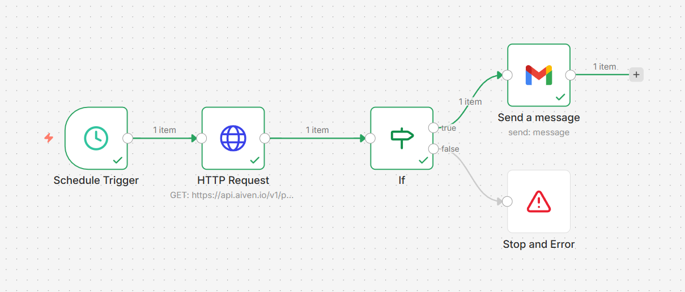

<div align="center">

# 🦀 AivenAutomation

**Automatically keeps your Aiven free PostgreSQL service alive — no manual logins needed.**


</div>

---

## 📌 Problem

<div align="center">

Aiven's free tier has a strict **7-day inactivity policy** — if neither you nor your app interacts with the platform within 7 days, Aiven automatically powers off your service. You then get an email like:

> *"Your free service pg-299a2a9f hasn't been actively used recently."*

</div>

And then you have to:
1. Remember to check your email
2. Open Aiven Console
3. Manually log in just to keep it alive
4. Repeat this every week... forever

This is frustrating when you're using the database for a side project or learning — you're not hitting it daily, but you don't want it dying on you either.

**This workflow eliminates that entirely** by automatically pinging the Aiven API every 2 days, which registers as platform activity and resets the idle timer — keeping your free service running indefinitely.

---

## 🏗️ Architecture

<div align="center">

### Workflow Diagram


### Node Flow (SVG)


</div>

The workflow follows a simple linear flow with a conditional branch at the end:

```
[Schedule Trigger] → [HTTP Request] → [IF: state == RUNNING?]
                                              ↓ true          ↓ false
                                       [Send Gmail]    [Stop & Error]
```

---

## ⚙️ How It Works

<div align="center">

```
Schedule Trigger (every 2 days @ 7 AM)
        ↓
HTTP GET → api.aiven.io/v1/project/kartavya/service/pg-299a2a9f
        ↓
IF → service.state == "RUNNING"?
    ✅ true  → Send Gmail: "Service is RUNNING"
    ❌ false → Stop and Error: "Automation stopped"
```

</div>

The API ping registers as platform activity on Aiven, preventing the idle shutdown.

---

## 🗂️ Workflow Nodes

<div align="center">

| Node | Type | Purpose |
|------|------|---------|
| Schedule Trigger | `n8n-nodes-base.scheduleTrigger` | Fires every 2 days at 7:00 AM |
| HTTP Request | `n8n-nodes-base.httpRequest` | Pings Aiven service endpoint |
| IF | `n8n-nodes-base.if` | Checks if service state is `RUNNING` |
| Send a message | `n8n-nodes-base.gmail` | Sends success email notification |
| Stop and Error | `n8n-nodes-base.stopAndError` | Halts workflow and flags the issue |

</div>

---

## 📡 API Details

**Endpoint used:**
```
GET https://api.aiven.io/v1/project/kartavya/service/pg-299a2a9f
```

**Why this URL?**
The [Aiven REST API](https://api.aiven.io/doc/) follows the pattern:
```
/v1/project/{project_name}/service/{service_name}
```
- `kartavya` → project name from the warning email
- `pg-299a2a9f` → service name from the warning email

**Auth Header:**
```
Authorization: aivenv1 <YOUR_TOKEN>
```

---

## ✅ IF Condition — Is It Correct?

```json
{{ $json.service.state }} == "RUNNING"
```

**Yes, this is correct.** The Aiven API response structure is:
```json
{
  "service": {
    "state": "RUNNING",
    "service_name": "pg-299a2a9f",
    ...
  }
}
```
So `$json.service.state` correctly reads the `state` field nested inside `service`.

---

## 🔍 How to Verify It's Actually Pinging (Not Faking)

### Method 1 — Check n8n Execution Logs
After the workflow runs, click the **HTTP Request node** in the execution history. You'll see the full JSON response from Aiven, including:
```json
{
  "service": {
    "state": "RUNNING",
    "service_name": "pg-299a2a9f",
    "service_type": "pg",
    ...
  }
}
```
If the ping was fake, you'd get an error or empty response — not real service data.

### Method 2 — Check Token "Last Used" on Aiven
Go to **Aiven Console → Profile → Tokens**. After each workflow run, the `Last used on` timestamp of your API token will update. This is proof the request actually hit Aiven's servers.

### Method 3 — Check Aiven Service Logs
In the Aiven Console, go to your `pg-299a2a9f` service → **Logs**. You'll see inbound API calls recorded there.

### Method 4 — Add a Debug Node in n8n
Insert a **Set** node after HTTP Request and log `{{ $json.service.state }}`. If it returns `RUNNING`, you know the API responded with real data.

---

## 🚀 Setup

1. Import `AivenAutomation.json` into your n8n instance
2. Replace `YOUR_AIVEN_URL` with:
   ```
   https://api.aiven.io/v1/project/kartavya/service/pg-299a2a9f
   ```
3. Replace `ACESS_TOKEN` with your **non-expiring** Aiven API token
4. Connect your Gmail account for the notification node
5. Click **Activate**

---

## 📊 Stats

<div align="center">

| Property | Value |
|----------|-------|
| Trigger frequency | Every 2 days |
| Trigger time | 7:00 AM |
| API calls per month | ~15 |
| Nodes | 5 |
| Credentials needed | Aiven API Token + Gmail OAuth |
| Project | kartavya |
| Service | pg-299a2a9f (PostgreSQL) |
| Notification email | mr.aksthegreat03042004@gmail.com |

</div>

---

## ⚠️ Important — Token Setup

<div align="center">

Use a **non-expiring** token (leave session duration blank when generating).
Do **not** use a browser session token (those expire in hours).

</div>

---

## 🙏 Acknowledgements

<div align="center">

Big thanks to the tools that made this possible:

| Tool | Role |
|------|------|
| [Aiven](https://aiven.io) | Free PostgreSQL tier + clean REST API |
| [n8n](https://n8n.io) | Open-source workflow automation platform |
| [Render](https://render.com) | Free hosting for n8n, runs 24/7 |
| [Gmail API](https://developers.google.com/gmail) | Notification layer for alerts |

</div>

---

<div align="center">

## 📄 License

MIT — free to use and modify.

**Made with 🦀 to defeat Aiven's idle timeout**

</div>